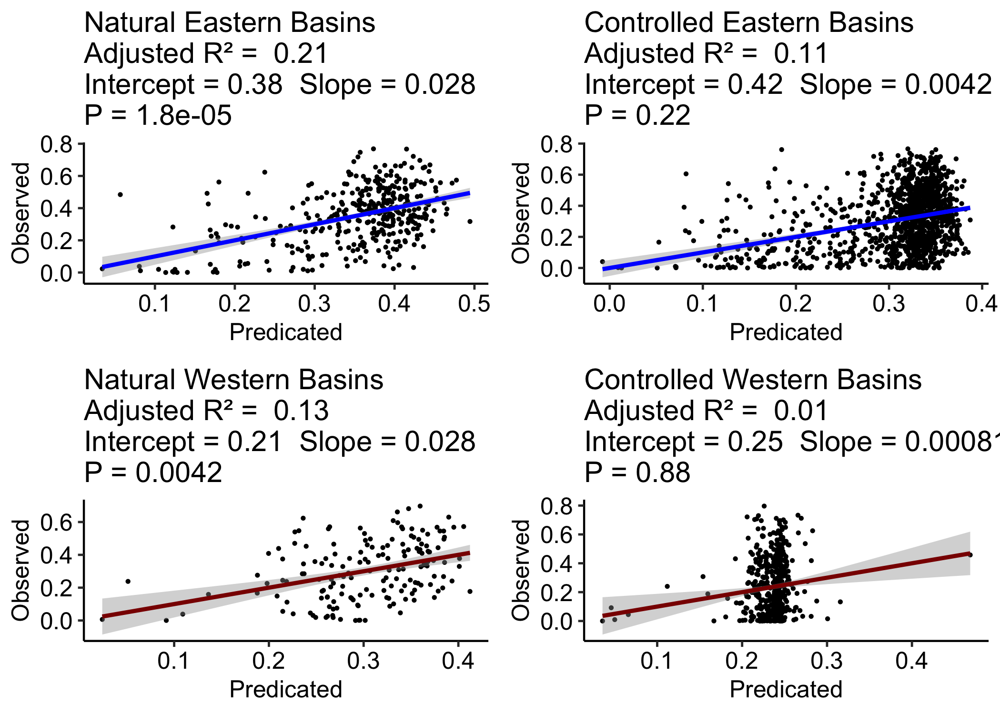

<style>
h1 { 
  text-align: center;
}
</style>

```{r, echo = F, warning=FALSE, message=F}
library(tidyverse)
library(sf)
library(ggpubr)
source("R/utils.R")
```

```{r, echo = FALSE}
breaks  = c(-Inf, 0, .1, .2,.3,.4,.5,.6,.7,.8)
labels  = c('< 0', '0 - 0.1', '0.1 - 0.2','0.2 - 0.3','0.3 - 0.4','0.4 - 0.5','0.5 - 0.6','0.6 - 0.7','>0.7')


breaks2  = c(0, .1,.2,.3,.4,.5,.6,.7,.8,  Inf)
labels2  = c('0 - 0.1', '0.1 - 0.2', '0.2 - 0.3','0.3 - 0.4','0.4 - 0.5','0.5- 0.6','0.6 - 0.7','0.7 - 0.8', '> 0.8')


txt = read.csv('data/info_stations.txt') %>% 
  select(site_no = siteID, CLASS, lat, lon, HUC2) %>% 
  mutate(site_no = sprintf("%08d", site_no)) %>% 
  mutate(region = ifelse( HUC2 < 13, "east", "west") )

HUC2 = read_sf('data/HUC2.shp') %>% st_transform(5070)

xx = readRDS("data/monthly-nse-a.rds")
xx$flow = recode(xx$flow, `high` = "High Flows",
                 `all` = "All Flows",`low` = "Low Flows")

xx2 = readRDS("data/nse-maps.rds") %>% st_set_crs(5070)

info = read.csv('data/info_stations.txt') %>% 
  mutate(siteID = sprintf("%08s", siteID))
csv  = read.csv('data/Verification_Metrics_overall_v2') %>% 
  mutate(siteID = sprintf("%08s", siteID))

dat = merge(info, csv) %>% 
  mutate(region = ifelse( HUC2 < 13, "east", "west") )
```

# Figures {.tabset}

## Figure 1


```{r, echo = FALSE, message = FALSE}

nat = xx2 %>% 
  gather(flow_type, value, allNSE, highNSE) %>% 
  filter(value > -2000) %>% 
  mutate(category = cut(value, breaks  = breaks, 
                        labels  = labels)) %>%
  mutate(category=factor(category, levels = unique(labels))) %>%
  na.omit()  
nat$flow_type =  recode(nat$flow_type, `allNSE` = "All Flows", `highNSE` = "High Flows")

nat$CLASS =  recode(nat$CLASS, `natural` = "Natural", `non-natural` = "Controlled")

nseA = ggplot() + 
  geom_sf(data = HUC2, fill = "white", size = .4) +
  geom_sf(data = nat, aes(color = factor(category)), size = .7) + 
  facet_grid(flow_type ~ CLASS) + 
  scale_colour_brewer(palette = "Spectral") +
  guides(col = guide_legend(override.aes = list(shape = 15, size = 10))) +
   my.theme + 
  labs(color = "")
  
nseA = annotate_figure(nseA, top = text_grob("NSE-A", color = "black", face = "bold", size = 28)) %>% 
  ggsave(file = 'img/figure1.png', width = 9.5)
```


## Figure 2


```{r, echo = F, warning = F, message=F}
f1  = ggplot(data = filter(xx, flow != "Low Flows")) + 
  geom_boxplot(aes(x = month, y = value, fill = CLASS), 
               alpha = .8, 
               outlier.shape = NA, color = "black", lwd = .8) +
  facet_wrap(~flow, scales="free") + 
  scale_x_discrete(labels= month.abb)  + 
  theme_pubr() + 
  theme(legend.position = "bottom",
        axis.text.x=element_text(color = "black", size=11, angle=90, vjust=.5, hjust=0.8),
        strip.text.x = element_text(size = 24),
        legend.text  = element_text(size = 24),
        axis.text.y = element_text(size=12, face="bold")) +
  fill_palette("aaas") +
  ylim(0,1)  +  
  grids(linetype = "solid", axis="y") +
  labs(title = "", x = "", y = "NSE-A (r2)", fill = "")

annotate_figure(f1, top = text_grob("Monthly NSE-A", color = "black", face = "bold", size = 36)) %>% 
  ggsave(file = 'img/figure2.png', width = 12)
```


## Figure 3


```{r, warning = FALSE, message = F, echo = F}
dat = mutate(dat, DA = log(DA)) %>% 
  na.omit()

#-----------
regional_stats(dat) %>% ggsave(file = "img/figure3.png")
```


## Figure 4

```{r, warning = FALSE, message = F, echo = F}
dat = readRDS("data/high-nse-a.rds") %>% 
   mutate(siteID= sprintf("%08s", site_no))

xxx = merge(dat, info) %>% 
  rename("NSE_A" = high) %>% 
  mutate(DA = log(DA)) %>% 
  mutate(region = ifelse( HUC2 < 13, "east", "west") ) %>% 
  na.omit()

#-----------

regional_stats(xxx) %>% ggsave(file = "img/figure4.png")
```



## Figure 5

```{r, echo = F, message = F, warning = F}

hum.names <- as_labeller(c(`natural` = "Natural", `non-natural` = "Controlled"))

natB = xx2 %>% 
  mutate(category = cut(allB, breaks  = breaks2, labels  = labels2)) %>% 
  mutate(category=factor(category, levels = unique(labels2))) %>%
  na.omit()

nseB = ggplot() + 
  geom_sf(data = HUC2, fill = "white", size = .4) +
  geom_sf(data = natB, aes(color = category), size = 1) + 
  facet_grid(~CLASS, labeller = hum.names) + 
  scale_colour_brewer(palette = "Spectral", direction = -1) +
  guides(col = guide_legend(override.aes = list(shape = 15, size = 10))) +
  my.theme +
  labs(color = "")

annotate_figure(nseB, top = text_grob("NSE-B All Flows", color = "black", face = "bold", size = 36)) %>% 
  ggsave(file = 'img/figure5.png', width = 9.5)
```


## Figure 6

```{r, echo = FALSE, warning = FALSE, message = FALSE}
natC = xx2 %>% 
  mutate(category = cut(allC, breaks  = breaks2, labels  = labels2)) %>% 
  mutate(category=factor(category, levels = unique(labels2))) %>% 
  na.omit()

nseC = ggplot() + 
  geom_sf(data = HUC2, fill = "white", size = .4) +
  geom_sf(data = natC, aes(color = category), size = 1) + 
  facet_grid(~CLASS, labeller = hum.names) + 
  scale_colour_brewer(palette = "Spectral", direction = -1) +
  guides(col = guide_legend(override.aes = list(shape = 15, size = 10))) +
  my.theme +
  labs(color = "")

annotate_figure(nseC, top = text_grob("NSE-C All Flows", color = "black", face = "bold", size = 36)) %>% 
  ggsave(file = 'img/figure6.png', width = 9.5)
```


## Figure 7

```{r, echo = FALSE, warning = FALSE, message = FALSE}

info$site_no = sprintf("%08s", info$siteID)

data = merge(xx2, info) %>% 
  mutate(region = ifelse( HUC2 < 13, "east", "west") )

ai = get_plot_data(data, 'AI')

f1  = ggplot(data = ai) + 
  theme_pubr() + 
  theme(legend.position = "NA",
        strip.text.x = element_text(size = 24)) +
  ylim(-10,5)  +  
  grids(linetype = "solid", axis="y") +
  labs(title = "", x = "", y = "log(NSEx)", fill = "Type") +
  geom_boxplot(aes(x = category, y = value, fill = x, alpha = x), 
               outlier.size = .1, color = "black", lwd = .1) +
  scale_fill_manual(name = "Type", values = c("#3B4992FF", "#3B4992FF", "#EE0000FF", "#EE0000FF")) +
  scale_alpha_manual(name = "Type", values = c(.8,.2,.8,.2)) + 
  facet_wrap(~ region, scale="free")

figure1 = annotate_figure(f1, top = text_grob("Aridity", color = "black", face = "bold", size = 24))

sto     = get_plot_data(data = filter(data, CLASS == "non-natural"), var = 'Mx_strg')

f2  = ggplot(data = sto) + 
  theme_pubr() + 
  theme(legend.position = "NA",
        strip.text.x = element_blank()) +
  ylim(-10,5)  +  
  grids(linetype = "solid", axis="y") +
  labs(title = "", x = "", y = "log(NSEx)", fill = "Type") +
  geom_boxplot(aes(x = category, y = value, fill = x), 
               outlier.size = .1, color = "black", lwd = .1, alpha = .8) +
  scale_fill_manual(name = "Type", values = c("#3B4992FF", "#EE0000FF")) +
  facet_wrap(~ region, scale="free")

figure2 = annotate_figure(f2, top = text_grob("Cummulative Upstream Storage", color = "black", face = "bold", size = 24))

da = get_plot_data(data = mutate(data, DA = log(DA)), var = 'DA')

f3  = ggplot(data = da) + 
  theme_pubr() + 
  theme(legend.position = "bottom",
        strip.text.x = element_blank(),
        legend.text = element_text(size = 18)) +
  ylim(-10,5)  +  
  grids(linetype = "solid", axis="y") +
  labs(title = "", x = "", y = "log(NSEx)", fill = "") +
  geom_boxplot(aes(x = category, y = value, fill = x, alpha = x), 
               outlier.size = .1, color = "black", lwd = .1) +
  scale_fill_manual(name = "", values = c("#3B4992FF", "#3B4992FF", "#EE0000FF", "#EE0000FF")) +
  scale_alpha_manual(name = "", values = c(.8,.2,.8,.2)) + 
  facet_wrap(~ region, scale="free")

figure3 = annotate_figure(f3, top = text_grob("Log Drainage Area", color = "black", face = "bold", size = 24))

ggarrange(figure1, figure2, figure3, ncol = 1, nrow = 3) %>% 
  ggsave(file = 'img/figure7.png', width = 10, height = 18)
```


